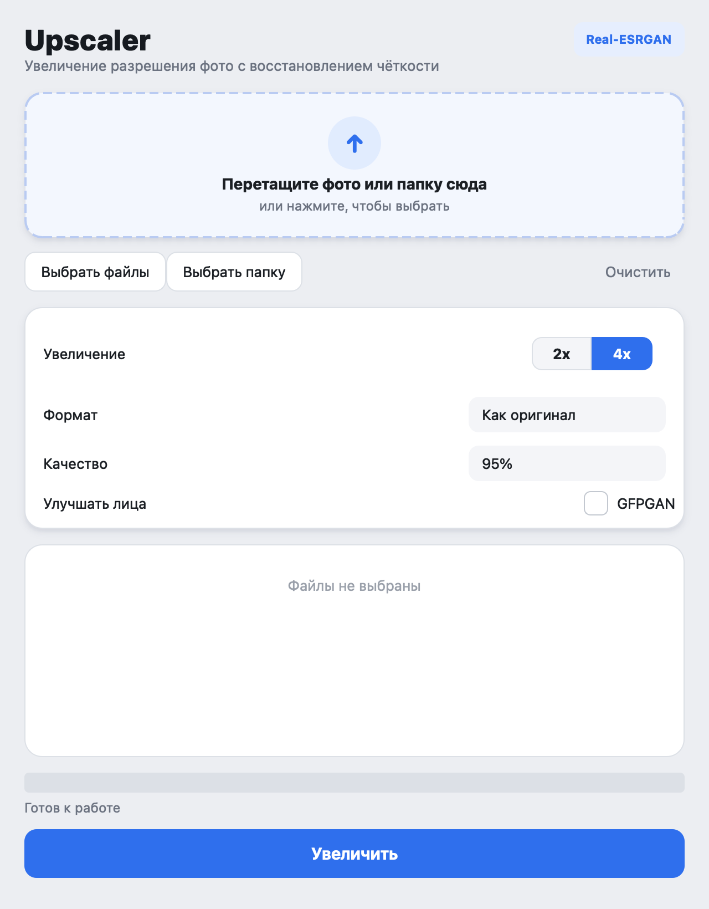
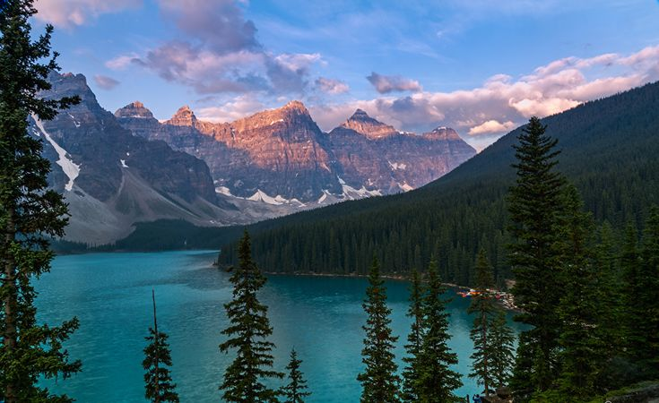
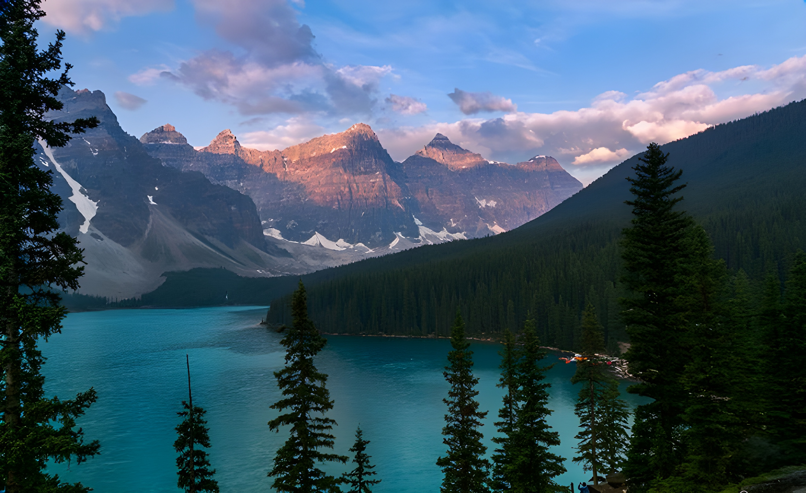
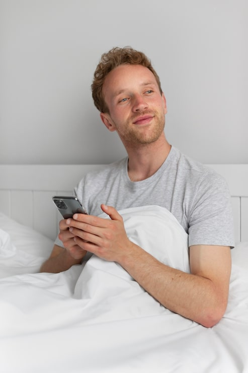
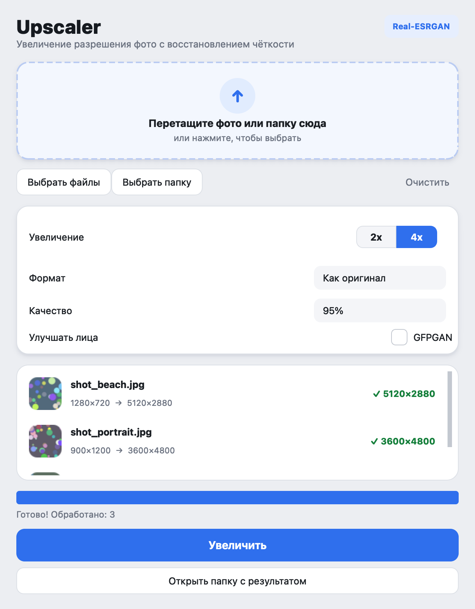

# 🔍 Upscaler

**English** | [Русский](README.ru.md)

> A native macOS app that upscales photos and restores sharpness using the Real-ESRGAN neural network. HD → 4K, no subscriptions and no cloud — everything runs locally on your own hardware.

[](https://www.python.org/)
[](https://developer.apple.com/metal/pytorch/)
[-41cd52?logo=qt&logoColor=white)](https://doc.qt.io/qtforpython/)
[](LICENSE)

<p align="center">
  
</p>

Drag a photo into the window, pick the scale (2x or 4x) — and the app runs it through [Real-ESRGAN](https://github.com/xinntao/Real-ESRGAN), restoring detail and sharpness. Portraits can be further refined with [GFPGAN](https://github.com/TencentARC/GFPGAN). Comes with both a GUI and a CLI.

---

## ✨ Features

- 🖥 **Native macOS app** — download the `.dmg`, drag it to Applications, done
- 🖱 **Drag-and-drop** — drop photos and folders straight into the window
- 🖼 **2x / 4x upscaling** with Real-ESRGAN (`x2plus` / `x4plus`)
- 👤 **Face restoration** via GFPGAN (a checkbox in settings)
- 📁 **Batch processing** — a whole folder at once
- 🍎 **Apple Silicon MPS** out of the box (Metal acceleration)
- 🎨 Output formats — **JPG / PNG / WebP** + quality control
- ⌨️ **CLI included** — for scripts and automation

---

## 🖼 Before & after

| Before | After (4x) |
|:---:|:---:|
|  |  |
| 720×480 | 2880×1920 |

| Portrait before | Portrait after (with GFPGAN) |
|:---:|:---:|
|  |  |

---

## 📥 Installation

### Requirements

- A Mac with **Apple Silicon** (M1/M2/M3/M4)
- **macOS 12** or newer
- Internet on **first** launch (to download the models, ~130 MB)

### Option 1. Download the ready-made app (easiest)

1. Go to the [**Releases**](https://github.com/DoonyFreeman/Console_upscaler/releases/latest) page and download **`Upscaler.dmg`**.
2. Open `Upscaler.dmg` with a double-click.
3. **Drag `Upscaler` into the Applications folder.**
4. **First launch:** in Applications, **right-click** `Upscaler` → **Open** → **Open** again.

> ⚠️ Step 4 is only needed **once**. The app isn't signed with a paid Apple certificate, so a plain double-click shows a warning. Right-click → Open makes macOS remember the permission.
>
> If it says "damaged", run this once in Terminal:
> ```bash
> xattr -dr com.apple.quarantine /Applications/Upscaler.app
> ```

### Option 2. Build from source

```bash
git clone https://github.com/DoonyFreeman/Console_upscaler.git
cd Console_upscaler
./install.sh        # environment & dependencies (Python 3.10–3.12)
./build.sh          # builds dist/Upscaler.app
./build_dmg.sh      # (optional) packages it into dist/Upscaler.dmg
```

> ⚠️ Requires Python **3.10–3.12** (3.13+ is not supported yet because of the old `basicsr`).

---

## 🚀 Usage

### App (GUI)

1. Drag a photo or folder into the window (or click "Choose files / folder").
2. Set the scale, format, quality, and optionally enable face restoration.
3. Click **Upscale**.
4. When done — **Open output folder**.

Results are saved next to the original with a `_4x` / `_2x` suffix.

| Choosing files | Processing done |
|:---:|:---:|
|  |  |

### Command line (CLI)

```bash
upscale photo.jpg                    # 4x by default → photo_4x.jpg
upscale photo.jpg -s 2               # 2x — faster
upscale photo.jpg -o result.png      # explicit output path
upscale ./photos/                    # batch over a whole folder
upscale photo.jpg --face             # with face restoration (GFPGAN)
upscale photo.jpg --format webp --quality 90
upscale photo.jpg --tile 256         # smaller tile — less memory
upscale                              # interactive wizard
```

| Flag | Default | What it does |
|---|---|---|
| `-s`, `--scale` | `4` | Scale factor: `2` or `4` |
| `-o`, `--output` | next to the original | Path to a file or folder |
| `--face` | off | Enable GFPGAN for faces |
| `--format` | same as input | `jpg` / `png` / `webp` |
| `--quality` | `95` | JPEG/WebP quality, 1–100 |
| `--tile` | `512` | Tile size; smaller = less memory |

Supported input formats: `jpg`, `jpeg`, `png`, `webp`, `tiff`, `tif`, `bmp`.

---

## 🧠 How it works

Two neural networks under the hood:

1. **Real-ESRGAN** (RRDBNet) — the main upscaler. 4x uses `RealESRGAN_x4plus`, 2x uses `RealESRGAN_x2plus`. The image is split into tiles (512 px by default, to fit in memory), each is run through the network and stitched back together.
2. **GFPGAN v1.3** — enabled by the "Restore faces" checkbox. Reconstructs faces specifically: eyes, mouth, skin. Great for old and group photos.

The device is chosen automatically: **MPS** (Metal) on Apple Silicon → **CUDA** → **CPU**. Model weights are downloaded from the official releases on first launch into `~/.upscaler/models/`.

---

## 🛠 Stack

Python · PyTorch (MPS) · Real-ESRGAN · GFPGAN · **PySide6 (Qt)** for the GUI · Click + Rich for the CLI · Pillow · OpenCV · PyInstaller for building the `.app`

```
upscaler/
├── gui.py        # PySide6 GUI (drag-and-drop, thumbnails)
├── app.py        # GUI entry point
├── cli.py        # Click CLI (flags, batch processing)
├── interactive.py# Interactive wizard on Rich
├── engine.py     # Real-ESRGAN + GFPGAN wrapper, device selection
└── utils.py      # collect_images, make_output_path, get_image_info
install.sh        # Environment setup
build.sh          # Build Upscaler.app (PyInstaller)
build_dmg.sh      # Package into a DMG
upscaler.spec     # PyInstaller config
```

---

## 🐛 FAQ

<details>
<summary><b>"Cannot be opened, developer cannot be verified"</b></summary>

The app isn't signed with an Apple certificate ($99/year). Right-click the app → Open → Open again. Needed once. Or: `xattr -dr com.apple.quarantine /Applications/Upscaler.app`.
</details>

<details>
<summary><b>Can I send it to a friend?</b></summary>

Yes, if your friend has an **Apple Silicon Mac**. Send them the `.dmg` (or the Releases link). First launch is via right-click → Open. The current build does not run on Intel Macs (a separate universal build would be needed).
</details>

<details>
<summary><b>Crashes with out-of-memory / hangs</b></summary>

In the CLI, reduce the tile size: `upscale photo.jpg --tile 256` (or 128 for very large photos).
</details>

<details>
<summary><b>It's slow</b></summary>

Make sure it uses `mps` (Apple Silicon), not `cpu`. On M-series chips MPS is picked up automatically if PyTorch is recent.
</details>

<details>
<summary><b>Where are the models? How do I re-download?</b></summary>

`~/.upscaler/models/`. Delete a file and it will be re-downloaded on the next run.
</details>

<details>
<summary><b>install.sh complains about Python 3.13</b></summary>

Real-ESRGAN pulls in the old `basicsr`, which isn't compatible with 3.13. Install 3.11: `pyenv install 3.11.9` or `brew install python@3.11`, then run `./install.sh` again.
</details>

---

## 🙏 Acknowledgements

- [xinntao/Real-ESRGAN](https://github.com/xinntao/Real-ESRGAN) — the model and architecture
- [TencentARC/GFPGAN](https://github.com/TencentARC/GFPGAN) — face restoration
- The PyTorch team — for the MPS backend
- [Qt for Python (PySide6)](https://doc.qt.io/qtforpython/) — for a reliable GUI on macOS

---

## 📄 License

[MIT](LICENSE). Don't forget the model licenses: Real-ESRGAN — BSD 3-Clause, GFPGAN — Apache 2.0.
