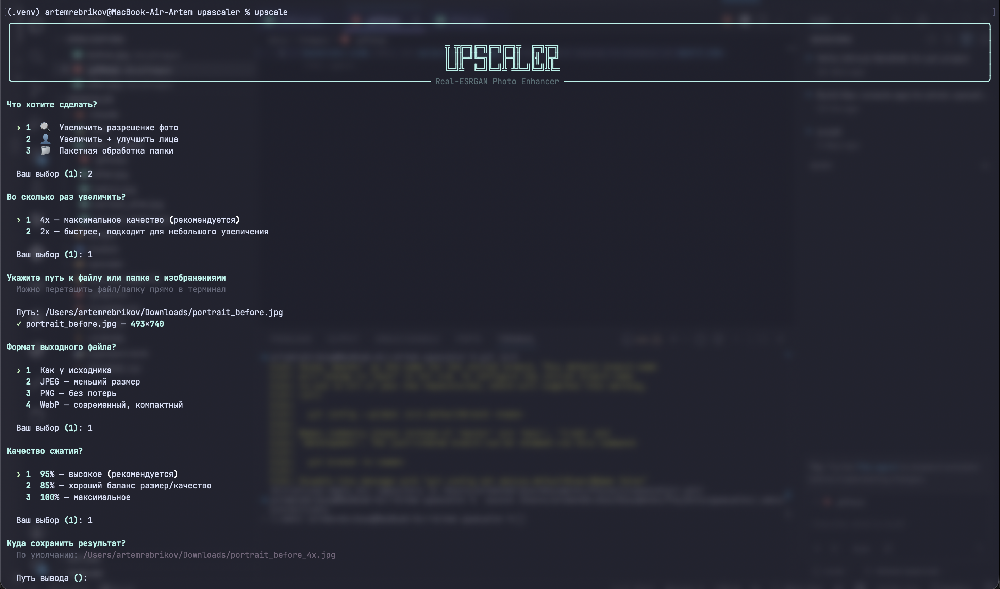

# 🔍 Upscaler

> Mac-native CLI для апскейла фото на Real-ESRGAN. HD → 4K без слёз, без подписок и без облака.

[](https://www.python.org/)
[](#установка)
[](https://developer.apple.com/metal/pytorch/)
[](LICENSE)
[](#)

Маленький домашний инструмент: увеличивает разрешение фотографий в 2 или 4 раза с помощью нейросети [Real-ESRGAN](https://github.com/xinntao/Real-ESRGAN), восстанавливает детали и резкость, а портреты опционально докручивает через [GFPGAN](https://github.com/TencentARC/GFPGAN). Всё локально, на вашем железе.

---

## ✨ Демо: до и после

| До | После (`upscale photo.jpg`) |
|:---:|:---:|
|  |  |
| 720×480 | 2880×1920 (4x) |

| Портрет до | Портрет после (`--face`) |
|:---:|:---:|
|  |  |
| Real-ESRGAN | + GFPGAN восстанавливает лицо |

---

## ⚡ Возможности

- 🖥 **Десктоп-приложение для macOS** — нативное окно, перетащил `.app` в «Программы» и пользуешься
- 🖼 **2x / 4x апскейл** на Real-ESRGAN (`x2plus` / `x4plus`)
- 👤 **Восстановление лиц** через GFPGAN (`--face`)
- 📁 **Batch-режим** — натравить на целую папку
- 🧙 **Интерактивный визард** — запустить `upscale` без аргументов и идти по шагам
- 🍎 **Apple Silicon MPS** из коробки, плюс CUDA и CPU-fallback
- 🎨 Выбор формата на выходе — **JPG / PNG / WebP** + настройка качества
- 📊 Красивый прогресс на Rich, без мусора в терминале

---

## 📦 Установка

### Требования

- **Python 3.10, 3.11 или 3.12** (важно: 3.13+ пока не поддерживается, потому что Real-ESRGAN тянет старый basicsr)
- macOS на Apple Silicon — главный целевой сценарий, всё ускоряется через MPS
- Linux/Windows с CUDA-GPU тоже работают; CPU работает, но медленно

### Быстрый старт

```bash
git clone https://github.com/<your-username>/upascaler.git
cd upascaler
./install.sh
source .venv/bin/activate
upscale --help
```

`install.sh` сам найдёт подходящий Python, создаст `.venv`, поставит PyTorch и все зависимости, и зарегистрирует команду `upscale`.

### Ручная установка

Если скрипт по какой-то причине не подошёл:

```bash
python3.11 -m venv .venv
source .venv/bin/activate
pip install --upgrade pip
pip install -e .
```

### Модели

Веса моделей (~64 МБ для Real-ESRGAN и ~340 МБ для GFPGAN) скачиваются **автоматически** при первом запуске в `~/.upscaler/models/`. Интернет нужен только один раз.

---

## 🖥 Десктоп-приложение (macOS)

Если не хочется терминала — есть нативное приложение с окном: выбираешь фото (кнопкой или перетаскиванием), настройки, жмёшь «Запустить».

### Сборка `.app`

```bash
./install.sh          # один раз: окружение и зависимости
./build.sh            # собирает приложение через PyInstaller
```

Готовое приложение появится в `dist/Upscaler.app`. Перетащите его в папку **«Программы»** — и можно запускать двойным кликом. При первом запуске приложение само скачает модели (~130 МБ).

> Интерфейс построен на нативных `tkinter/ttk` (тема macOS aqua) — выглядит как обычное системное приложение, без терминала.

---

## 🚀 Использование (CLI)

### Интерактивный режим

Просто запустите без аргументов — визард задаст всё пошагово:

```bash
upscale
```



### Прямые команды

```bash
upscale photo.jpg                    # 4x по умолчанию → photo_4x.jpg
upscale photo.jpg -s 2               # 2x — быстрее
upscale photo.jpg -o result.png      # явный путь вывода
upscale ./photos/                    # batch по всей папке
upscale photo.jpg --face             # с восстановлением лица (GFPGAN)
upscale photo.jpg --format webp --quality 90
upscale photo.jpg --tile 256         # меньше тайл — меньше памяти
```

### Все флаги

| Флаг | По умолчанию | Что делает |
|---|---|---|
| `-s`, `--scale` | `4` | Кратность: `2` или `4` |
| `-o`, `--output` | рядом с оригиналом | Путь к файлу или папке |
| `--face` | выкл. | Включить GFPGAN для лиц |
| `--format` | как у исходника | `jpg` / `png` / `webp` |
| `--quality` | `95` | Качество JPEG/WebP, 1–100 |
| `--tile` | `512` | Размер тайла; меньше = меньше памяти |

Поддерживаемые форматы на вход: `jpg`, `jpeg`, `png`, `webp`, `tiff`, `tif`, `bmp`.

---

## 🧠 Как это работает

Под капотом — две модели:

1. **Real-ESRGAN** (RRDBNet) — основной апскейлер. Для 4x используется `RealESRGAN_x4plus`, для 2x — `RealESRGAN_x2plus`. Модель берёт картинку, разбивает на тайлы (по умолчанию 512 px, чтобы хватало памяти на ноутбуке), прогоняет каждый и склеивает обратно с padding'ом.
2. **GFPGAN v1.3** — включается флагом `--face`. Хорошо реконструирует именно лица: глаза, рот, кожу. Полезно для старых портретов и групповых фото.

Устройство выбирается автоматически: **MPS** на Apple Silicon → **CUDA**, если есть → **CPU** как fallback. На M1/M2/M3 всё работает прямо на GPU без шаманства с драйверами.

Веса моделей качаются с официальных релизов [xinntao/Real-ESRGAN](https://github.com/xinntao/Real-ESRGAN/releases) и [TencentARC/GFPGAN](https://github.com/TencentARC/GFPGAN/releases).

---

## 🐛 FAQ / Если что-то пошло не так

<details>
<summary><b>«Не ставится / install.sh ругается на Python 3.13»</b></summary>

Real-ESRGAN тянет старый `basicsr`, который ещё не дружит с Python 3.13. Поставьте 3.11 или 3.12:

```bash
# через pyenv
pyenv install 3.11.9
pyenv local 3.11.9

# или через brew
brew install python@3.11
```

После этого запустите `./install.sh` ещё раз.
</details>

<details>
<summary><b>Падает с out-of-memory / зависает</b></summary>

Уменьшите размер тайла:

```bash
upscale photo.jpg --tile 256   # или даже 128 для очень больших фото
```

</details>

<details>
<summary><b>Очень медленно работает</b></summary>

Посмотрите в логе строку при загрузке модели — должно быть `device: mps` (на Mac) или `device: cuda` (на ПК с GPU). Если там `cpu`, апскейл будет в разы медленнее. На Apple Silicon MPS должен подхватиться сам, если PyTorch свежий.
</details>

<details>
<summary><b>Где лежат модели? Как перекачать?</b></summary>

`~/.upscaler/models/`. Удалите файл — он перекачается при следующем запуске.
</details>

<details>
<summary><b>Качество хуже, чем ожидал</b></summary>

- Для портретов попробуйте `--face` — GFPGAN заметно лучше реконструирует лица.
- Для шумных/мыльных снимков лучше работает 4x, чем 2x (контринтуитивно, но так).
- Очень мелкий текст и сетки/решётки апскейлеры в принципе плохо умеют — это нормально.
</details>

---

## 🛠 Стек

Python • PyTorch (MPS) • Real-ESRGAN • GFPGAN • Click • Rich • Pillow • OpenCV

---

## 📂 Структура проекта

```
upscaler/
├── cli           # Click CLI: парсинг флагов, batch, прогресс
├── interactive   # Пошаговый визард на Rich Prompts
├── gui           # Десктоп-интерфейс на tkinter/ttk (нативный вид)
├── app           # Точка входа для GUI
├── engine        # Обёртка над Real-ESRGAN + GFPGAN, выбор устройства
└── utils         # collect_images, make_output_path, get_image_info
install.sh        # Установщик одной командой
build.sh          # Сборка Upscaler.app через PyInstaller
upscaler.spec     # Конфиг PyInstaller
assets/icon.icns  # Иконка приложения
pyproject.toml    # Пакет + зависимости
```

---

## 🗺 Roadmap

- [ ] Прогресс по тайлам внутри одной картинки, а не только по файлам
- [ ] Профили для разных типов фото (портрет / пейзаж / скан)
- [ ] Опциональный денойз перед апскейлом
- [ ] Веб-UI поверх того же движка (на случай если надоест терминал)

PR-ы и issue приветствуются — это пет-проект, всё в свободное время.

---

## 🙏 Благодарности

- [xinntao/Real-ESRGAN](https://github.com/xinntao/Real-ESRGAN) — за саму модель и архитектуру
- [TencentARC/GFPGAN](https://github.com/TencentARC/GFPGAN) — за восстановление лиц
- Команде PyTorch — за MPS-бэкенд, без которого этот проект на Mac не имел бы смысла

---

## 📄 Лицензия

[MIT](LICENSE). Делайте что хотите, только не забудьте про лицензии моделей (Real-ESRGAN — BSD 3-Clause, GFPGAN — Apache 2.0).
